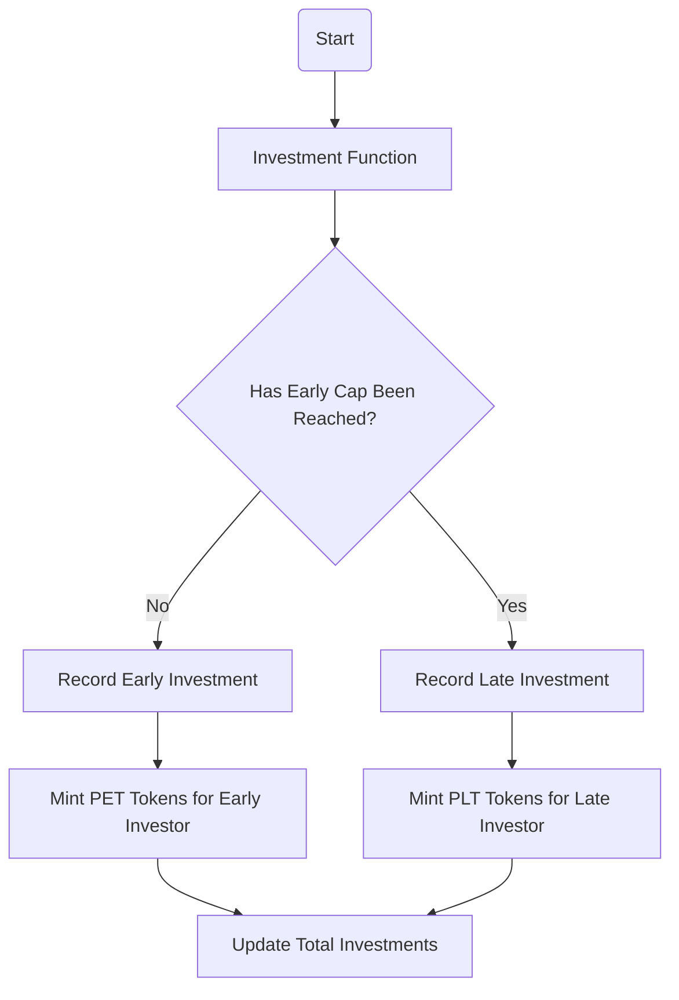
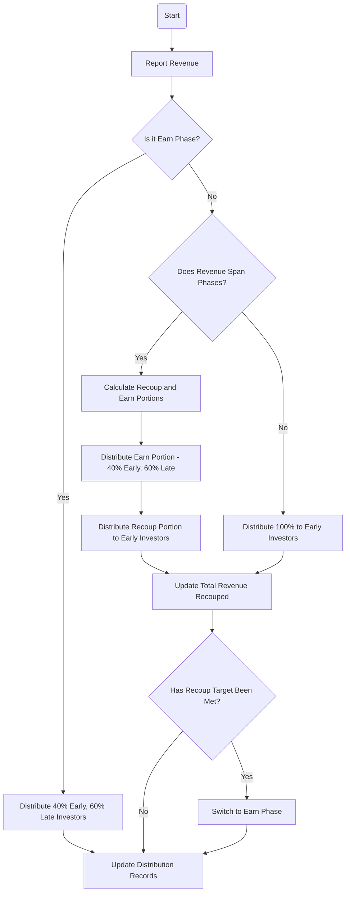
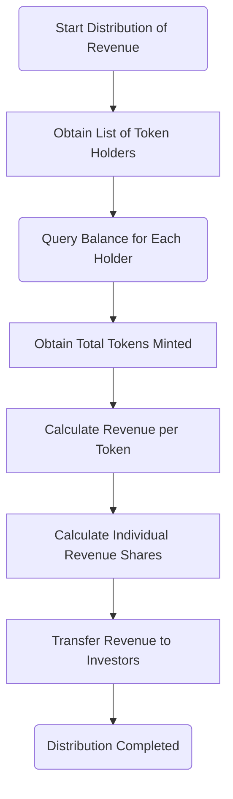

# Objective

The goal is to build an architecture of the smart contract(s) that accomplishes the revenue distribution for the following scenario.

We have a project in which there are 2 tier of investors. Investors get ERC20 in return for their investments. Early investors invested a total of 500k USD. Late investors invested a total of 750k USD. We want the project to have a “recoup” phase and “earn” phase. Recoup phase ends when the project earns 500k in revenue.

In the recoup phase 100% of the revenue stream should go to early investors.

In the earn phase 40% should go to early investors and 60% to late investors.

Additionally we would like to keep track of categories of income that the project makes. We would like to separately track revenue coming from “tickets”, “merchandise” and “ads”.

Hint: bonus points for not introducing custom interfaces.

# Solution Architecture

<!-- START doctoc generated TOC please keep comment here to allow auto update -->
<!-- DON'T EDIT THIS SECTION, INSTEAD RE-RUN doctoc TO UPDATE -->
**Table of Contents**

- [Introduction](#introduction)
- [Special considerations for the ERC20 Tokens](#special-considerations-for-the-erc20-tokens)
    - [Option 1: Separate Token Contracts for Early and Late Investors](#option-1-separate-token-contracts-for-early-and-late-investors)
    - [Option 2: Tracking Investor Status within the Investment Contract](#option-2-tracking-investor-status-within-the-investment-contract)
    - [Option 3: Using Token Attributes or Extensions](#option-3-using-token-attributes-or-extensions)
  - [My choice](#my-choice)
- [Contract 1 for Investment and Token distribution](#contract-1-for-investment-and-token-distribution)
    - [Interaction with the ERC-20 Token Contracts](#interaction-with-the-erc-20-token-contracts)
- [Contract 2 for Revenue Tracking and Distribution](#contract-2-for-revenue-tracking-and-distribution)
  - [Key Functions and Logic:](#key-functions-and-logic)
  - [Integration with Token Contracts for Revenue distribution](#integration-with-token-contracts-for-revenue-distribution)
  - [Flow diagram of revenue tracking and distribution:](#flow-diagram-of-revenue-tracking-and-distribution)
  - [Distribution of Revenue](#distribution-of-revenue)
- [Contracts 3 and 4 for ERC20 Tokens](#contracts-3-and-4-for-erc20-tokens)
  - [ProjectEarlyToken (PET) Contract](#projectearlytoken-pet-contract)
  - [ProjectLateToken (PLT) Contract](#projectlatetoken-plt-contract)
- [4. No Custom Interfaces](#4-no-custom-interfaces)
- [5. Security Considerations](#5-security-considerations)
- [6. Testing and Auditing](#6-testing-and-auditing)
- [7. Legal and Regulatory Compliance](#7-legal-and-regulatory-compliance)
- [8. Additional Considerations](#8-additional-considerations)

<!-- END doctoc generated TOC please keep comment here to allow auto update -->

## Introduction

We will implement 4 smart contracts that will work in tandem.

* Contract 1 for Investment and Token distribution
* Contract 2 for Revenue Tracking and distribution
* Contract 3 and 4 for ERC20 Tokens

## Special considerations for the ERC20 Tokens

As we have to distinguish between early and late investors, we can do this in 3 different ways:

#### Option 1: Separate Token Contracts for Early and Late Investors

Create two distinct ERC-20 token contracts, one for early investors and another for late investors. This method clearly differentiates the two groups based on the token type they hold.

* Pros: Clear distinction between investor groups; straightforward revenue distribution based on token type.
* Cons: Increased complexity in managing two token types.

#### Option 2: Tracking Investor Status within the Investment Contract

Maintain a mapping within the Investment and Token Distribution Contract that records the status (early or late) of each investor based on their address.

```solidity
mapping(address => bool) public isEarlyInvestor;
```
When distributing revenue, the contract checks this mapping to determine the investor's status and applies the appropriate distribution logic.

* Pros: Single token type simplifies token management; investor status is easily verifiable on-chain.
* Cons: Requires additional storage and logic within the contract; investor status must be set accurately at the time of investment.

#### Option 3: Using Token Attributes or Extensions

Utilize ERC-20 token extensions or additional attributes to embed investor status within the token itself, possibly through token metadata or a modified token standard that supports attributes.

* Pros: Investor status is inherently tied to the token, simplifying status verification.
* Cons: May require a custom token implementation; compatibility issues with standard ERC-20 interfaces and infrastructure. Doesn't comply with design requirements.

### Selected Option

In the following architecture design we will go with Option 1, as it provides a clear distinction between investor groups and simplifies revenue distribution based on token type.

We will assume a 1:1 ratio of USD dollar invested:Token minted.

Also note, that in this case the token for early investor will be capped at 500k USD (and therefore 500k tokens) but the token for late investors will not be capped, in case new investors arrive in the future. This is a design decisition but of course could be modified if we prefer to block late investors after we reach a certain amount (like the additional 750k USD).

## Contract 1 for Investment and Token distribution

This contract manages the initial investment phase and coordinates with the separate ERC-20 Token Contracts to issue tokens to investors.

* Investment Function: Investors send USD (or a stablecoin equivalent) to invest in the project. The contract differentiates between early and late investments based on reaching the first 500k.

* Token Distribution: Upon receiving an investment, the contract communicates with the ERC-20 Token Contracts to mint tokens. It will either mint PET or PLT tokens depending on the investors tier (early or late). The exact rate at which tokens are minted per USD invested can be predefined in this contract, but we will mint 1 token per USD.

* Investment Caps: The PET contract enforces early investment caps for 500k USD to ensure early investments can't exceed the planned amount.

Note: For simplification we are not considering the case where we receive an investment that would involve both tiers (early and late). In this case we would have to split the investment and mint the tokens accordingly, adding complexity to the design.

#### Interaction with the ERC-20 Token Contracts

To facilitate token distribution, the Investment and Token Distribution Contract should have the authority to call the mint function of the ERC-20 Token Contract. This can be achieved by setting the Investment and Token Distribution Contract as the owner (or an authorized minter) of the ERC-20 Token Contract.

Flow diagram of investment and token distribution:


## Contract 2 for Revenue Tracking and Distribution

This smart contract manages the revenue generated by the project and ensures its distribution according to the defined phases and rules. The contract's logic is designed to accommodate the transition between the "recoup" phase and the "earn" phase, as well as to handle scenarios where a single revenue event spans both phases.

It also includes the functionality to track revenue by different categories, facilitating detailed financial analysis and reporting.

### Key Functions and Logic:

1. Report Revenue: This function is the entry point for logging revenue as it comes in. To maintain detailed financial records it records the amount and the category of the revenue: Tickets, merchandise or ads.

2. Phase Check: Upon reporting revenue, the contract checks the current phase of the project:
    * If the project is in the earn phase, the revenue is immediately processed according to the earn phase distribution rules (40% to early investors, 60% to late investors).
    * If the project is not in the earn phase, it proceeds to check whether the incoming revenue spans both the recoup and earn phases.

3. Revenue Spanning Phases: If a revenue event spans both phases, the contract calculates the portions attributable to each phase:
    * The portion up to the completion of the recoup target is considered part of the recoup phase.
    * Any revenue beyond the recoup target is processed according to the earn phase distribution rules.

4. Distribution:
    * Recoup Phase: If entirely in the recoup phase or for the recoup portion of a spanning event, 100% of the revenue is distributed to early investors.
    * Earn Phase: For revenue in the earn phase or the earn portion of a spanning event, the revenue is split 40% to early investors and 60% to late investors.

5. Update Records:
    * The contract updates the total revenue recouped after distributing any portion classified under the recoup phase. This is crucial for tracking progress towards completing the recoup phase.
    * Distribution records are updated whenever revenue is distributed in the earn phase. This includes both direct earn phase distributions and the earn portion of spanning events.

6. Phase Transition: After updating the total recouped revenue, the contract checks whether the recoup target has been met:
    * If the target is met, the contract transitions the project to the earn phase, adjusting the distribution logic for future revenues accordingly.

This contract structure ensures that revenue is distributed fairly according to investor agreements and the project's financial milestones. It accommodates complex scenarios where a single revenue event can push the project from the recoup phase into the earn phase, ensuring a smooth transition and accurate record-keeping throughout the project's lifecycle.

### Integration with Token Contracts for Revenue distribution

"Contract 2: Revenue Tracking and Distribution" needs to interact with both the ProjectEarlyToken (PET) and ProjectLateToken (PLT) contracts to:

* Determine Token Holdings: The need to get the number of tokens each investor holds to calculate their share of the revenue. This is achieved by calling the `balanceOf(account)` function provided by the ERC-20 standard in both PET and PLT contracts for each investor's address.

* Calculate Revenue Shares: Based on the token holdings and the total supply of each token type, the contract calculates the proportion of revenue each investor is entitled to. In the recoup phase, 100% of the revenue is allocated to PET holders. In the earn phase, revenue is split between PET and PLT holders at 40% and 60%, respectively.

* Distribute Revenue: After calculating the revenue shares, the contract needs a mechanism to distribute these amounts to the investors. This could involve transferring funds directly to investors' addresses, crediting their balances within the contract for later withdrawal, or another method suitable for the project's needs.

### Flow diagram of revenue tracking and distribution:


### Distribution of Revenue

In the above flow we mentioned several sections where distribution of revenue must occur. Zooming in on these sections we can see that the distribution of revenue will require the following steps:



Description of Each Step:

**1. Obtain List of Token Holders**: We will need to get the list of investors to be able to distribute the revenue. As we are using ERC-20 tokens that can be transfered freely between users, this list cannot be created in the Investment and Token Distribution Contract when created. 

Instead we will need to query the blockchain to obtain the list of addresses that hold the tokens at the time the revenue distribution needs to occur. For this can either:

a) Use an decentralized Indexing Service like [The Graph](https://thegraph.com/). We an create and use subgraphs that indexes `Transfer` events emmitted by the token contracts to keep track of the token holders.

b) Use centralized services like [Infura](https://www.infura.io/) or [Alchemy](https://www.alchemy.com/) to query `Transfer` events.

c) Modify the PET and PLT token contracts to maintain a dynamic list of active token holders and update the list on token transfers and minting. This would require additional storage and logic within the token contracts.


**2. Query Balance for Each Holder:** Once the list of token holders is obtained, the next step is to query the balance of each holder. This involves calling the `balanceOf(account)` function from the ERC-20 standard for each address to determine how many tokens each investor holds.

**3. Obtain Total Tokens Minted:** This step involves determining the total supply of the tokens, which can be done through the `totalSupply` function of the ERC-20 standard. This information is essential for calculating the revenue share per token.

**4. Calculate Revenue per Token:** With the total revenue amount and the total tokens minted known, the revenue per token can be calculated. This figure is essential for determining how much each token holder should receive based on the number of tokens they hold.

$$ Revenue Per Token = \frac{Total Revenue to Distribute}{Total Tokens Minted} $$

Where:
- **Total Revenue to Distribute** is the amount of revenue allocated for distribution to token holders.
- **Total Tokens Outstanding** refers to the total number of tokens held by investors.

**5. Calculate Individual Revenue Shares**: Using the revenue per token we calculate the revenue share for each investor based on their token holdings. This step involves simple multiplication of the revenue per token by the number of tokens each investor holds.

$$ Revenue Share = Revenue Per Token \times Tokens Held $$

**6. Transfer Revenue to Investors:** The final step involves transferring the calculated revenue shares to the respective investors. This could involve making transactions to transfer cryptocurrency or fiat equivalent to each investor's address or account, depending on the system's setup.

## Contracts 3 and 4 for ERC20 Tokens

As stated before, we will have two tokens for early and late investors.

These contracts represent the ERC-20 tokens, called ProjectEarlyToken (PEK) and ProjectLateToken (PLT) that will issued to investors during the investment phase.

We will need two separate smart contracts. Each of these contracts will define the behavior and rules for each type of token. 

* ProjectEarlyToken (PET): With a cap of 500k tokens, representing the early investor tier.
* ProjectLateToken (PLT): Without a cap, representing the late investor tier.

The owner of these contracts will have to be "Contract 1: Investment and Token Distribution" so that it can mint the tokens.

### ProjectEarlyToken (PET) Contract

This contract will create PET tokens with a capped supply to reflect the $500k USD investment limit for early investors. The cap ensures that no more tokens can be minted once the limit is reached, aligning with the investment cap for early investors.

Key Features:

* Supply Cap: The total supply of PET tokens is capped at the equivalent of $500k USD investment.
* Mint Function: Allows minting up to the cap, ensuring no additional tokens can be created once the cap is reached.

```solidity
// SPDX-License-Identifier: MIT
pragma solidity ^0.8.24;

import "@openzeppelin/contracts/token/ERC20/ERC20.sol";
import "@openzeppelin/contracts/access/Ownable.sol";

contract ProjectEarlyToken is ERC20, Ownable {
    uint256 public constant MAX_SUPPLY = 500000 * 10**18; // Including decimals

    constructor() ERC20("ProjectEarlyToken", "PET") {}

    function mint(address to, uint256 amount) public onlyOwner {
        require(totalSupply() + amount <= MAX_SUPPLY, "Cap exceeded");
        _mint(to, amount);
    }
}
```

### ProjectLateToken (PLT) Contract

The PLT contract will manage the tokens for late investors and will not have a supply cap, allowing for flexible minting based on late-stage investment inflows.

Key Features:

* Unlimited Supply: No cap on the total supply, allowing for as many tokens to be minted as needed based on late investments.
* Mint Function: Permits the contract owner to mint new tokens at any time without restrictions.

```solidity
// SPDX-License-Identifier: MIT
pragma solidity ^0.8.24;

import "@openzeppelin/contracts/token/ERC20/ERC20.sol";
import "@openzeppelin/contracts/access/Ownable.sol";

contract ProjectLateToken is ERC20, Ownable {
    constructor() ERC20("ProjectLateToken", "PLT") {}

    function mint(address to, uint256 amount) public onlyOwner {
        _mint(to, amount);
    }
}
```

## 4. No Custom Interfaces

The smart contract architecture leverages standard interfaces and established patterns wherever possible to ensure compatibility and reduce complexity:

* [ERC-20 Standard](https://ethereum.org/en/developers/docs/standards/tokens/erc-20/): Utilize the ERC-20 standard for the investment tokens. This standardization ensures compatibility with a wide range of wallets, exchanges, and other contracts.

* [OpenZeppelin Contracts](https://www.openzeppelin.com/contracts): Utilize OpenZeppelin's library of secure, standardized contracts for implementing features like token creation, access control, and security measures, avoiding the need for custom interfaces.

## 5. Security Considerations

Implementing comprehensive security practices is crucial to protect the contracts and users' investments against common vulnerabilities. Some best practices include:

* Checks-Effects-Interactions Pattern: To prevent reentrancy attacks, we should make sure that interactions with external contracts occur only after all internal state updates and effects.
* Reentrancy Guard: Utilize OpenZeppelin's ReentrancyGuard to block nested calls to critical functions.
* Limiting Access: Use OpenZeppelin's Ownable and Roles libraries to restrict sensitive operations (like minting or updating contract logic) to authorized addresses.
* Secure Math: Use OpenZeppelin's SafeMath library to prevent integer underflows and overflows.

## 6. Testing and Auditing

Comprehensive testing and potential third-party audits are essential to ensure the reliability and security of the contracts. We need to develop a suite of unit and integration tests covering all contract functionalities and edge cases. Use frameworks like Hardhat for testing. After thorough internal testing, obtaining audits from reputable security firms can add an additional layer of assurance.

## 7. Legal and Regulatory Compliance

Given the financial nature of the project, adhering to relevant legal and regulatory requirements is paramount. This may include:

* KYC/AML: Know Your Customer (KYC) and Anti-Money Laundering (AML) checks for investors, possibly by integrating with third-party services or maintaining a whitelist of verified addresses.
* Securities Law Compliance: Depending on the jurisdiction and the nature of the tokens, they may be considered securities. Consulting with legal experts to ensure compliance with securities laws and regulations is critical.
* Data Privacy: Even though they aren't any in this design, we should ensure that any off-chain components of the project comply with data protection regulations such as GDPR.

## 8. Additional Considerations

When designing and implementing the smart contract architecture for this project, several additional factors should be taken into account to ensure robustness, security, and flexibility:

* Fiat vs Crypto Investments: We need to consider if we need mechanisms for accepting fiat investments or if instead all investments will be done in crypto (like a stable coin). This can affect the design as it might require integrating with external payment gateways or oracles to verify fiat transactions and trigger token minting.

* While current design specifies two phases (recoup and earn) with fixed distribution percentages. While these are the initial project assumptions, we lack the flexibility to adapt to changing circumstances. We might want to consider a more flexible approach that allows for dynamic adjustment of revenue distribution based on changing project conditions.

* Gas Optimization: Optimize the contract's functions for gas efficiency, considering the potentially high volume of transactions for revenue tracking and distribution.

* Upgradeability: To ensure that the smart contracts can be updated in response to evolving requirements or to address unforeseen issues, we can consider implementing an upgradeable contract design. This can be achieved using the proxy pattern, where a proxy contract delegates calls to an implementation contract, and the implementation can be swapped without losing the state or deployed contract address.

* Decentralized Governance: For key decisions and operations, especially those related to categorizing and reporting revenue, we can consider implementing decentralized governance mechanisms, allowing stakeholders to participate in decision-making processes.